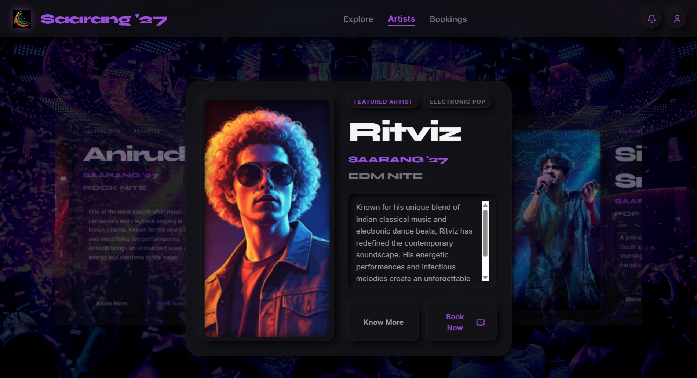

# Creative Artist Card Component

An elegant, responsive, and highly interactive Artist Card component built to showcase creative profiles, social links, and portfolios seamlessly across all device sizes.

## 🚀 Live Link
[Click here to view the live app](https://saarangartist.netlify.app/)

## 📸 Application Screenshot


## ✨ UI/UX Highlights & Features
- **Fluid Motion & Micro-interactions:** Smooth hover effects on buttons, interactive social media icons, and transitions that make the card feel alive and responsive.
- **Modern Minimalist Aesthetics:** Designed using clean layouts, high typography contrast, and balanced padding to ensure content readability.
- **Fully Responsive Layout:** Optimized with Tailwind's flexbox and grid utilities to render beautifully on mobile devices, tablets, and wide screens.

## 🛠️ Tech Stack
- **Frontend:** React / Vite
- **Styling:** Tailwind CSS
- **Icons:** React Icons

## ⚙️ How to Run Locally

Follow these steps to get a local copy of the project up and running on your machine.

### 1. Clone the Repository
Open your terminal and run the following command to clone the project:
```bash
git clone [https://github.com/anandhu-o/artist_card.git](https://github.com/anandhu-o/artist_card.git)


### 2. Install Dependencies
#Install all the required npm packages (React, Vite, Tailwind, React Icons):

npm install

### 3. Start the Development Server
#Run the local Vite development environment:

npm run dev
#Once the server starts, open your browser and go to http://localhost:5173 to view and test the interactive Artist Card!